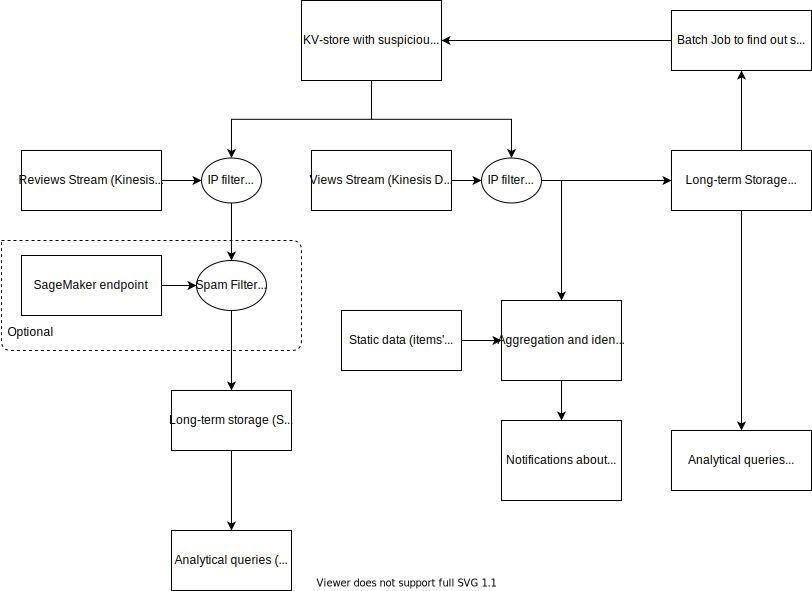

# Repository with materials for students of [Amazon Big Data GridU course](https://gridu.litmos.com/course/2859381)

Modules description:
* `cloudformation` - project template for AWS Cloudformation
* `src` - source code

## High-level architecture of the project

